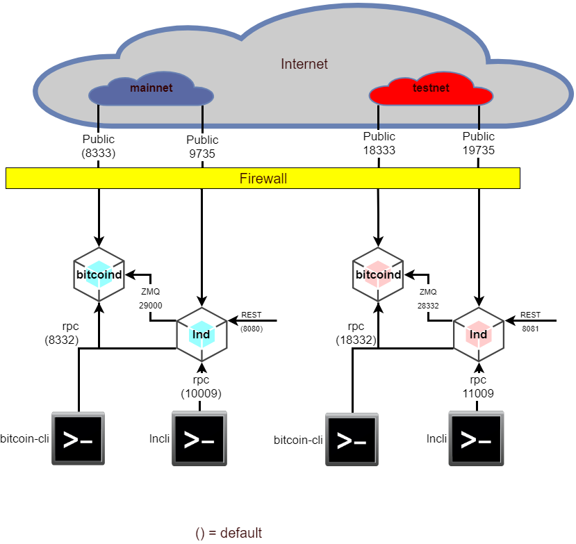

[All Extras](README.md) / Simultaneous mainnet & testnet

UNDER CONSTRUCTION

---

# IMPORTANT ! #
These instructions have NOT been tested in where the Raspibolt had existing Bitcoins in the mainnet wallet.

Do not follow these instructions if unless your Raspibolt mainnet Bitcoin wallet and channel balances are zero - otherwise you may loose all those Bitcoins.

---


# Introduction #
There is no reason that you can not run both mainnet & testnet lnd instances at the same time on one [RaspiBolt](https://github.com/Stadicus/guides/blob/master/raspibolt/README.md). These instructions assume you have a working [RaspiBolt](https://github.com/Stadicus/guides/blob/master/raspibolt/README.md) running in Testnet mode.

# A Diagram to make things clearer #


After completing these instructions here, the 4 instances shown will be operating on the ports shown above. 

# Overview #

1. [Open new firewall port](#open-new-firewall-port)
1. [Shutdown existing services](#shutdown-existing-services)
1. [Make testnet3 directory for lnd](make-testnet3-directory-for-lnd)
1. [New conf files](#new-conf-files)
1. [New services](#new-services)
1. [Enable and start new services](#enable-and-start-new-services)
1. [cli Aliases](#cli-aliases)
1. [Optional] [Update the raspibolt System Overview utility](#update-the-raspibolt-system-overview-utility)

## Open New Firewall Port ##
1. Open new port in RaspiBolt

`admin ~  ฿  sudo su`
```
$ ufw allow 19735  comment 'allow Lightning (testnet)'
$ ufw status
$ exit
```
<details><summary>Click to see ufw status</summary><p>
  
```bash
root@RaspiBolt:/home/admin# ufw status
Status: active

To                         Action      From
--                         ------      ----
22                         ALLOW       192.168.0.0/24             # allow SSH from local LAN
9735                       ALLOW       Anywhere                   # allow Lightning
8333                       ALLOW       Anywhere                   # allow Bitcoin mainnet
18333                      ALLOW       Anywhere                   # allow Bitcoin testnet
19735                      ALLOW       Anywhere                   # allow Lightning (testnet)
9735 (v6)                  ALLOW       Anywhere (v6)              # allow Lightning
8333 (v6)                  ALLOW       Anywhere (v6)              # allow Bitcoin mainnet
18333 (v6)                 ALLOW       Anywhere (v6)              # allow Bitcoin testnet
19735 (v6)                 ALLOW       Anywhere (v6)              # allow Lightning (testnet)
```
</p>
</details>
<br>

2. Open new port in Router

Review the [Raspberry Pi](https://github.com/Stadicus/guides/blob/master/raspibolt/raspibolt_20_pi.md) guide from [Stadicus](https://github.com/Stadicus). Go to the *Accessing your router* section and add this port forwarding:

|Application name|External port|Internal port|Internal IP address|Protocol (TCP or UDP)|
|--|--|--|--|--|
|19375|19375|`<Raspibolt IP>`|`<Raspibolt IP>`|BOTH|

## Shutdown existing services ##
```
admin ~  ฿  sudo systemctl stop lnd
admin ~  ฿  sudo systemctl stop bitcoind
admin ~  ฿  sudo systemctl disable lnd
admin ~  ฿  sudo systemctl disable bitcoind
```

NO!!!!!
##Make testnet3 Directory for lnd ##
```bash
admin /home/bitcoin/.lnd  ฿  cd /home/bitcoin/.lnd
admin /home/bitcoin/.lnd  ฿  sudo mkdir testnet3
admin /home/bitcoin/.lnd  ฿  sudo chown bitcoin:bitcoin testnet3
admin /home/bitcoin/.lnd  ฿  sudo cp -p *.macaroon testnet3
admin /home/bitcoin/.lnd  ฿  sudo cp -p tls.* testnet3
admin /home/bitcoin/.lnd  ฿  sudo cp -pr data testnet3
admin /home/bitcoin/.lnd  ฿  ls testnet3
total 36
drwxr-xr-x 4 bitcoin bitcoin 4096 Apr 16 17:25 .
drwxr-xr-x 5 bitcoin bitcoin 4096 Apr 16 16:58 ..
-rw------- 1 bitcoin bitcoin  232 Apr  8 14:29 admin.macaroon
drwx------ 4 bitcoin bitcoin 4096 Apr  8 14:25 data
-rw-r--r-- 1 bitcoin bitcoin  115 Apr  8 14:29 invoice.macaroon
drwx------ 3 bitcoin bitcoin 4096 Apr  2 11:20 logs
-rw-r--r-- 1 bitcoin bitcoin  183 Apr  8 14:29 readonly.macaroon
-rw-r--r-- 1 bitcoin bitcoin  741 Apr  8 19:45 tls.cert
-rw------- 1 bitcoin bitcoin  227 Apr  8 19:45 tls.key
```
NO!!!

## New conf files ##
Create or update the files below.

The command to use is:

`admin ~  ฿  sudo nano <filename>`

Don't forget to Edit these lines as needed:
* bitcoin.conf files: *rpcpassword=PASSWORD_[B]* 
* lnd.conf files: *alias=YOUR_NAME [LND]* 

<details><summary>Click to see /home/bitcoin/.bitcoin/bitcoin.conf</summary><p>

```bash
# RaspiBolt LND  bitcoind configuration
# /home/bitcoin/.bitcoin/bitcoin.conf

zmqpubrawblock=tcp://127.0.0.1:29000
zmqpubrawtx=tcp://127.0.0.1:29000

# Bitcoind options
server=1
daemon=1
txindex=1
disablewallet=1

# Connection settings
rpcuser=raspibolt
rpcpassword=PASSWORD_[B]

# Raspberry Pi optimizations
dbcache=100
maxorphantx=10
maxmempool=50
maxconnections=40
maxuploadtarget=5000
```
</p></details>

<details><summary>Click to see /home/bitcoin/.bitcoin/testnet3/bitcoin.conf</summary><p>

```bash
# RaspiBolt LND  bitcoind configuration
# /home/bitcoin/.bitcoin/testnet3/bitcoin.conf

testnet=1
zmqpubrawblock=tcp://127.0.0.1:28332
zmqpubrawtx=tcp://127.0.0.1:28332

# Bitcoind options
server=1
daemon=1
txindex=1
disablewallet=1

# Connection settings
rpcuser=raspibolt
rpcpassword=PASSWORD_[B]

# Raspberry Pi optimizations
dbcache=100
maxorphantx=10
maxmempool=50
maxconnections=40
maxuploadtarget=5000
```
</p></details>


<details><summary>Click to see /home/bitcoin/.lnd/lnd.conf</summary><p>

```bash
# RaspiBolt LND Mainnet: lnd configuration
# /home/bitcoin/.lnd/lnd.conf

[Application Options]
debuglevel=info
debughtlc=true
maxpendingchannels=5
alias=YOUR_NAME [LND]
color=#68F442

[Bitcoin]
bitcoin.active=1

# enable either testnet or mainnet
#bitcoin.testnet=1
bitcoin.mainnet=1

bitcoin.node=bitcoind

[Bitcoind]
bitcoind.zmqpath=tcp://127.0.0.1:29000

[autopilot]
autopilot.active=1
autopilot.maxchannels=5
autopilot.allocation=0.6
```
</p></details>

<details><summary>Click to see /home/bitcoin/.lnd/lnd_testnet.conf</summary><p>

```bash
# RaspiBolt LND Testnet: lnd configuration
# /home/bitcoin/.lnd/lnd_testnet.conf

[Application Options]
debuglevel=info
debughtlc=true
maxpendingchannels=5
alias=YOUR_NAME [LND]
color=#68F442
rpclisten=localhost:11009
restlisten=localhost:8081
listen=0.0.0.0:19735

[Bitcoin]
bitcoin.active=1

# enable either testnet or mainnet
bitcoin.testnet=1
#bitcoin.mainnet=1

bitcoin.node=bitcoind

[Bitcoind]
bitcoind.zmqpath=tcp://127.0.0.1:28332

[autopilot]
autopilot.active=1
autopilot.maxchannels=5
autopilot.allocation=0.6
```
</p></details>

## New services ##
Create or update the files below.

The command to use is:

`admin ~  ฿  sudo nano <filename>`

<details><summary>Click to see /etc/systemd/system/bitcoind.service</summary><p>

```bash
# RaspiBolt LND Mainnet: systemd unit for bitcoind
# /etc/systemd/system/bitcoind.service

[Unit]
Description=Bitcoin daemon
Wants=getpublicip.service
After=getpublicip.service

# for use with sendmail alert (coming soon)
#OnFailure=systemd-sendmail@%n

[Service]
User=bitcoin
Group=bitcoin
Type=forking
PIDFile=/home/bitcoin/.bitcoin/bitcoind.pid
ExecStart=/usr/local/bin/bitcoind
KillMode=process
Restart=always
TimeoutSec=120
RestartSec=30

[Install]
WantedBy=multi-user.target
```
</p></details>

<details><summary>Click to see /etc/systemd/system/bitcoind_testnet.service</summary><p>

```bash
# RaspiBolt LND Testnet: systemd unit for bitcoind
# /etc/systemd/system/bitcoind_testnet.service

[Unit]
Description=Bitcoin Testnet daemon
Wants=getpublicip.service
After=getpublicip.service

# for use with sendmail alert (coming soon)
#OnFailure=systemd-sendmail@%n

[Service]
User=bitcoin
Group=bitcoin
Type=forking
PIDFile=/home/bitcoin/.bitcoin/testnet3/bitcoind.pid
ExecStart=/usr/local/bin/bitcoind -testnet
KillMode=process
Restart=always
TimeoutSec=120
RestartSec=30

[Install]
WantedBy=multi-user.target
```
</p></details>

<details><summary>Click to see /etc/systemd/system/lnd.service</summary><p>
  
```bash
# RaspiBolt LND Mainnet: systemd unit for lnd
# /etc/systemd/system/lnd.service

[Unit]
Description=LND Lightning Daemon
Wants=bitcoind.service
After=bitcoind.service

# for use with sendmail alert
#OnFailure=systemd-sendmail@%n

[Service]
# get var PUBIP from file
EnvironmentFile=/run/publicip

ExecStart=/usr/local/bin/lnd --configfile=/home/bitcoin/.lnd/lnd.conf --externalip=${PUBLICIP}:19735
User=bitcoin
Group=bitcoin
LimitNOFILE=128000
Type=simple
KillMode=process
TimeoutSec=180
Restart=always
RestartSec=60

[Install]
WantedBy=multi-user.target
```
</p></details>

<details><summary>Click to see /etc/systemd/system/lnd_testnet.service</summary><p>
  
```bash
# RaspiBolt LND Testnet: systemd unit for lnd
# /etc/systemd/system/lnd_testnet.service

[Unit]
Description=LND Lightning Daemon
Wants=bitcoind.service
After=bitcoind.service

# for use with sendmail alert
#OnFailure=systemd-sendmail@%n

[Service]
# get var PUBIP from file
EnvironmentFile=/run/publicip

ExecStart=/usr/local/bin/lnd   --configfile=/home/bitcoin/.lnd/lnd_testnet.conf --externalip=${PUBLICIP}:19735
User=bitcoin
Group=bitcoin
LimitNOFILE=128000
Type=simple
KillMode=process
TimeoutSec=180
Restart=always
RestartSec=60

[Install]
WantedBy=multi-user.target
```
</p></details>

## Enable and start new services ##
```
admin ~  ฿  sudo systemctl enable bitcoind
admin ~  ฿  sudo systemctl enable bitcoind_testnet
admin ~  ฿  sudo systemctl enable lnd
admin ~  ฿  sudo systemctl enable lnd_testnet
admin ~  ฿  sudo systemctl start bitcoind
admin ~  ฿  sudo systemctl start bitcoind_testnet
admin ~  ฿  sudo systemctl start lnd
admin ~  ฿  sudo systemctl start lnd_testnet
```

## cli Aliases ##
To simplify accessing the 4 daemons from the command line, setup these 4 aliases for the admin account.

`admin ~  ฿  sudo nano /home/admin/.bash_aliases`
```bash
alias bcm='bitcoin-cli -datadir=/home/bitcoin/.bitcoin'
alias bct='bcm -testnet'
alias lcm='lncli'
alias lct='lcm --rpcserver=localhost:11009'
```
To test these are working OK...
```bash
admin ~  ฿  bcm getblockchaininfo
...
  "chain": "main"
...
admin ~  ฿  bct getblockchaininfo
...
  "chain": "test",
...
admin ~  ฿  lcm unlock
...
??
...
admin ~  ฿  lct unlock
...
?
...
```

## Update the raspibolt System Overview utility ##

tba

# Summary of Changes Needed #
This table shows the state we need to get to so the two lnd instances do not clash. 

|Module|Chain|Item|Original<br>After|Change?|
|-----:|-----|----|:-------|------------|
|bitcoind|mainnet|Public Port|8333<br>8333||
|||RPC Port|8332<br>8332||
|||conf file|/home/bitcoin/.bitcoin/bitcoin.conf<br>/home/bitcoin/.bitcoin/bitcoin.conf||
|||service file|/etc/systemd/system/bitcoind.service<br>/etc/systemd/system/bitcoind.service||
|||data/log files|xx<br>|xx|
||testnet|Public Port|18333<br>18333||
|||RPC Port|18332<br>18332||
|||conf file|/home/bitcoin/.bitcoin/bitcoin.conf<br>/home/bitcoin/.bitcoin/bitcoin_testnet.conf|Yes|
|||service file|/etc/systemd/system/bitcoind.service<br>/etc/systemd/system/bitcoind_testnet.service|Yes|
|||data/log files|xx<br>|xx|
|lnd|mainnet|Public Port|9735<br>9735||
|||RPC Port|10009<br>10009||
|||conf file|/home/bitcoin/.lnd/lnd.conf<br>|xx|
|||service file|/etc/systemd/system/lnd.service<br>/etc/systemd/system/lnd.service||
|||data/wallet files|???<br> |xx|
|||log files|/home/bitcoin/.lnd<br>???|xx|
|||Security files|/home/bitcoin/.lnd<br>???|xx|
||testnet|Public Port|9735<br>19735|Yes|
|||RPC Port|10009<br>11009|Yes|
|||conf file|/home/bitcoin/.lnd/lnd.conf<br>/home/bitcoin/.lnd/lnd_testnet.conf|Yes|
|||service file|/etc/systemd/system/lnd.service<br>/etc/systemd/system/lnd_testnet.service|Yes|
|||data/wallet files|/home/bitcoin/.lnd/data/chain/bitcoin/testnet<br>/home/bitcoin/.lnd/data/chain/bitcoin/testnet||
|||log files|/home/bitcoin/.lnd/logs/bitcoin/testnet<br>/home/bitcoin/.lnd/logs/bitcoin/testnet||
|||Security files|/home/bitcoin/.lnd<br>????|xx|


????

```
admin ~  ฿  sudo cp -p /home/bitcoin/.lnd/tls.key /home/bitcoin/.lnd/main/
admin ~  ฿  sudo cp -p /home/bitcoin/.lnd/tls.cert /home/bitcoin/.lnd/main/
admin ~  ฿ sudo cp -p /home/bitcoin/.lnd/admin.macaroon /home/bitcoin/.lnd/main/
sudo su bitcoin
lncli --lnddir /home/bitcoin/.lnd/main create
```


`Use Password_[A]`

admin ~  ฿  sudo adduser bitcoin_testnet
admin ~  ฿  cd /mnt/hdd 
admin /mnt/hdd  ฿  sudo su bitcoin
bitcoin@RaspiBolt:/mnt/hdd $ mkdir bitcoin_testnet
bitcoin@RaspiBolt:/mnt/hdd $ mkdir lnd_testnet
bitcoin@RaspiBolt:/mnt/hdd $ exit
admin /mnt/hdd  ฿  sudo chown -R bitcoin_testnet:bitcoin_testnet /mnt/hdd/bitcoin_testnet
admin /mnt/hdd  ฿  sudo chown -R bitcoin_testnet:bitcoin_testnet /mnt/hdd/lnd_testnet


